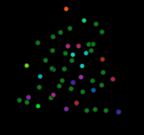
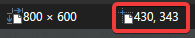

# rpi-xmas-led

This repository contains the code needed to run the addressable RGB lights for the CRCHUM Epilepry Group.
The LEDs are of type WS2811, controlled by a Raspberry Pi 4.
We have currently 2 kits of 50 lights each for a total of 100 individual LEDs.
While the code in this repository is not meant to be plug-and-play from your own device, it can be helpful to start making your own.

This project was inspired by [Matt Parker and his 3D Christmas Tree][standupmaths-tree].

<center>
    
    <br>
    (A christmas tree)
</center>

## Hardware

The hardware used are:
- 2 x WS2811 Individually addressable LED modules (50 each)
- A 5V 1A power supply
- A Raspberry Pi 4 Model B (with Raspberry Pi OS Bookworm)
- A few extension Dupont wires!

The connections are:
- Power supply to the 5V and Ground wires of the LED module (two exposed wires, not in the connector)
- Data and Ground of the LED connector to the GPIO21 and Ground (physical pin 39) of the Raspberry Pi, respectively.
    I used Dupont wires for the connections here.
- If needed, I also used Dupont wires to extend the connection between the two LED kits, making *very sure* to connect the 5V and Ground of one kit to the ones of the next one, as those connectors can be connected the wrong way too!

See the [schematic file](.github/images/led-schematic.png).

## Software

I installed Python 3.11 using the [miniforge distribution][miniforge] for the aarch64 architecture (the one for Raspberry Pi).
Then the necessary packages were installed by running the command
```sh
pip install --force-reinstall -r requirements.txt
```
with the ``requirements.txt`` file provided in the repo. You could install it in a separate environment if you want.

## Coordinates Mapping

One way to get the *x-y* coordinates of the LEDs is to take a picture with all the lights in frame, and use their pixel position as a coordinate system.
I used [paint.net][paint.net], imported a picture took with my phone where all the LEDs were visible, flipped the image vertically, and used my cursor to get the pixel positions (lower right of the window) for each LEDs, one by one, in order.



Write those coordinates in a .csv file (in the format ``xxxx,yyyy``, one per line) and the rest of the code should work.
**It is important to flip the image vertically because the origin of the image is in the upper left corner, and Cartesian coordinates have the origin at the lower left corner.**

## The Different Files

- ``colors.py``: Where the different color effects are kept.
    Most functions here are Generators and return a list of RGB color tuples, where each element is between 0 and 255 inclusively.
    Each ``yield`` of these functions are equivalent to one "frame" of an animation.

- ``coords.csv`` and ``coords.py``: Files for the coordinates of the drawing.
    The CSV file contains the actual coordinates, the Python file loads those coordinates and normalizes them to be between -1 and +1.

- ``plot.py``: File to run the animations in a ``matplotlib`` animation.
    This is to easily test new colors generators without having to run the code directly on the Raspberry Pi as it does not need to load the packages to control the LEDs.

- ``main.py``: This runs the animations on the Raspberry Pi, controlling the LEDs.

- ``kill.sh``: If the ``main.py`` file was run in the background, this file kills the process and clears the LEDs, essentially turning them off. It needs ``sudo`` to run correctly.

- ``tests.py``: Where I ran my tests at first. Don't expect these functions to run correctly.

## How To Run Continuously

The LED control needs root to run correctly (it will complain anyway if it is not "sudoed").
One simple way to run it in the background is to run:
```sh
sudo /full/path/to/python3.11 /path/to/rpi-xmas-led/main.py &
```
The ``&`` character sends the process in the background.

What I did, since it does not need to run 24/7, is setup entries in Cron to start the lights in the morning, and stop them at night.
Those entries are
```
# Start the lights at 7:00
0 7 * * * /full/path/to/python3.11 /path/to/rpi-xmas-led/main.py & >/dev/null 2>&1
# Kill the lights at 20:00
0 20 * * * bash /path/to/rpi-xmas-led/kill.sh >/dev/null 2>&1
```
Add those lines in the editor opened by ``sudo crontab -e``.

[standupmaths-tree]: https://youtu.be/TvlpIojusBE
[paint.net]: https://www.getpaint.net/
[miniforge]: https://conda-forge.org/miniforge/
